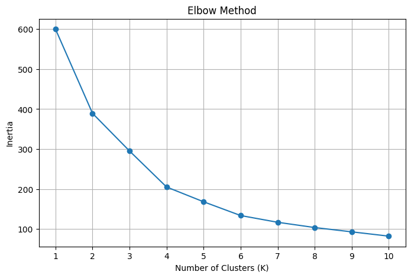
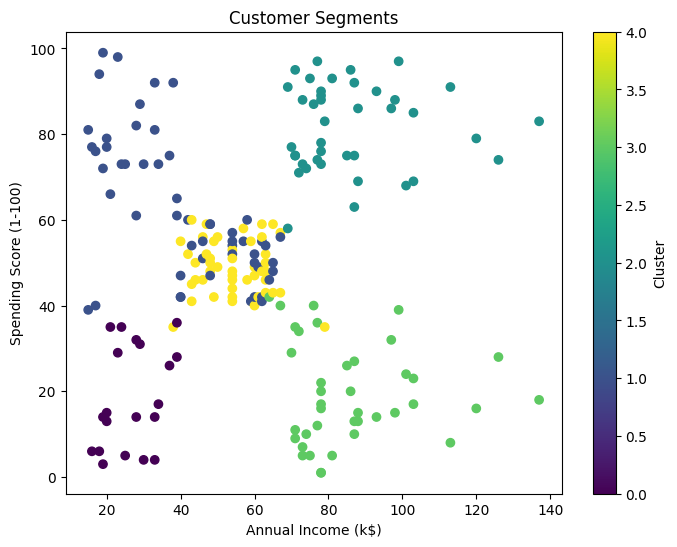
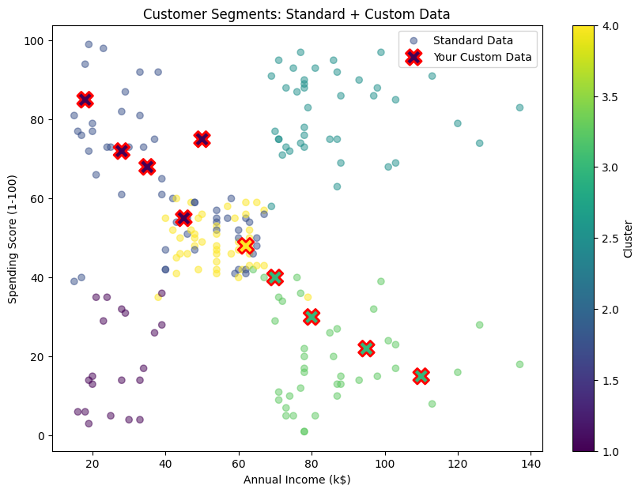

# K-Means Clustering: Customer Segmentation

## Project Overview

This project implements a K-Means clustering pipeline using Scikit-Learn to segment
mall customers based on Age, Annual Income, and Spending Score. The trained model
is then tested on real-world custom survey data collected from 10 individuals.

## Folder Structure
```
220141-kmeans-clustering/
├── dataset/
│   ├── Mall_Customers.csv
│   └── custom_survey_data.csv
├── model/
│   ├── 220141.pkl
│   └── scaler.pkl
├── Screenshots/
│   ├── elbow_plot.png
│   ├── cluster_plot.png
│   └── final_plot.png
├── 220141.ipynb
└── README.md
```


## Dataset

- **Standard Dataset:** Mall Customers Dataset (200 records) — Age, Annual Income (k$), Spending Score (1-100)
- **Custom Dataset:** Survey data from 10 real individuals with the same features

## Pipeline Steps

1. **Data Loading (Automation):** Used `!git clone` to automatically pull this repository
   (including standard and custom datasets) inside the Colab notebook — no manual uploads required
2. **Preprocessing:** Applied `StandardScaler` to normalize features (mean=0, std=1),
   since K-Means relies on Euclidean distance and unscaled data would bias the clusters
3. **Optimal K Selection (Elbow Method):** Looped through K=1 to 10, fit a KMeans model
   for each, and recorded the Within-Cluster Sum of Squares (WCSS/Inertia). The elbow
   occurred at K=5, where the rate of decrease in inertia slows significantly
4. **Model Fitting:** Trained `KMeans(n_clusters=5, init='k-means++', random_state=42)`
   on the scaled standard dataset
5. **Model Persistence:** Saved the fitted model and scaler using `joblib`:
   - `model/220141.pkl` — trained KMeans model
   - `model/scaler.pkl` — fitted StandardScaler
6. **Real-World Prediction:** Loaded custom survey data via pandas, applied the
   **same fitted scaler** (transform only, no refit), and used `model.predict()`
   to assign each of the 10 custom data points to existing clusters

## Visualizations

### Elbow Method (Optimal K Selection)



### Cluster Visualization (Standard Data)



### Final: Standard Data + Custom Survey Data



## Cluster Interpretation

- **Cluster 0:** [Describe — e.g., Young customers, low income, high spending score → "Impulsive young spenders"]
- **Cluster 1:** [Describe — e.g., Middle-aged, average income, average spending → "Standard customers"]
- **Cluster 2:** [Describe — e.g., High income, high spending → "Premium target customers"]
- **Cluster 3:** [Describe — e.g., High income, low spending → "Careful/wealthy savers"]
- **Cluster 4:** [Describe — e.g., Older, low income, low spending → "Budget-conscious customers"]

## Custom Data Results

All 10 custom survey individuals were passed through the same scaling pipeline
(transform only) and assigned to one of the 5 established clusters using the
trained model's `predict()` method. [Add 1-2 sentences on notable results —
e.g., "Person 6 (Age 19, low income, high spending score) was classified into
Cluster 0, consistent with the 'impulsive young spenders' segment."]

## Files

- `220141.ipynb` — Full pipeline notebook
- `dataset/Mall_Customers.csv` — Standard training dataset
- `dataset/custom_survey_data.csv` — Custom survey data (10 individuals)
- `model/220141.pkl` — Trained K-Means model
- `model/scaler.pkl` — Fitted StandardScaler
- `images/` — Saved visualization plots

## How to Run

Open `220141.ipynb` in Google Colab and run all cells in order. The notebook
automatically clones this repository to access the datasets — no manual file
uploads are required.
